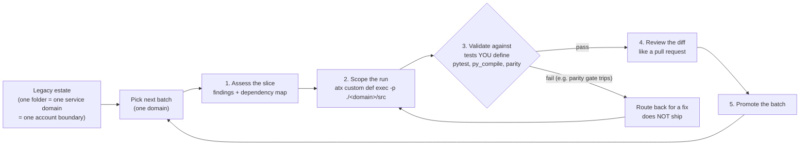

# Paying Down Lambda Tech Debt with AWS Transform Custom

A hands-on lab and reference-architecture demo for modernizing a large estate of
end-of-support Python Lambda functions with [AWS Transform](https://aws.amazon.com/transform/) Custom.

This repo is a **mock fintech-shaped organization** carrying real Python 3.10
tech debt across several service domains. It exists to answer one question that
every org with a big legacy estate asks:

> "AWS Transform can upgrade a function. But how do I actually *proof* it across
> hundreds of functions and dozens of accounts without shipping behavior drift?"

The answer this lab demonstrates: **you don't run one giant transform and pray.
You scope the work into small batches, validate each batch against tests you
define, review the diff like a PR, promote, and move to the next slice.** That
batching model is the whole point.

---

## Why this is structured the way it is

Real organizations don't file their code by "all the `distutils` usages over
here." They file it by **service and by account**. AWS Transform Custom also has
a real constraint today: **no cross-account transformation-definition sharing at
launch**, so a large multi-account fleet is run **per-account** (scripted with
`atx ... -x`). So this repo mirrors that reality:

- Each **top-level folder is a service domain** (a stand-in for an account /
  ownership boundary). That folder is the natural **scoping unit** for a single
  `atx` run.
- Within each domain, the handlers carry a **deliberate spread of deprecated
  idioms** (not 30 copies of the same one), so every batch you run teaches you
  something different.
- Each domain has a `BATCH.md` **manifest** naming which handler carries which
  idiom and the exact `atx` command to scope the run to that batch. That gives
  you single-variable clarity when you want to attribute a result, without
  faking the folder structure.

The runtime debt itself is declared where it really lives: in each domain's
`template.yaml` (SAM), on `Runtime: python3.10`. Nothing here is deployed. AWS
Transform operates on the **code repo**, commits to a **local git branch**, and
never touches a live function.

---

## The batching methodology (the reference pattern)



The loop runs once per service domain. The validation gate is the point: a transform that
changes behavior fails your tests and routes back; it never promotes on the agent's own
"success" line.

For each batch (one service domain):

1. **Assess** the slice (`AWS/comprehensive-codebase-analysis` or the runtime
   upgrade definition's own analysis pass). Read the findings and dependency map.
2. **Scope the run** to just that domain: `atx custom def exec -p ./<domain>/src ...`
3. **Validate against tests YOU define.** `pytest` green, `python -m py_compile`
   clean, and byte/behavior parity on the representative handlers.
4. **Review the diff** like any pull request. `git diff <base>..HEAD`.
5. **Promote** the batch, then repeat on the next domain.

The compliance-relevant beat: **failed validation routes back for a fix, it does
not ship.** One handler per estate is seeded to make that gate visible (see the
Watch-the-gate note below).

---

## Running a batch (example: payments-service)

Prereqs: WSL/Linux, AWS CLI v2, `atx` CLI installed, `git`, and **two Python
interpreters**: a **3.10** for the before-baseline and a **3.13** for the
after-validation. (AWS Transform Custom runs on Linux/WSL only.)

The 3.10 interpreter is not optional. Several seeded idioms (`distutils`, `imp`,
`cgi`, `imghdr`, `pipes`, `crypt`, `@asyncio.coroutine`) were **removed** from
newer Pythons, so the baseline tests only collect on 3.10. If you run them on a
3.12+ interpreter they fail at import: that is the debt the lab is about, not a
repo bug. Quickest way to get both interpreters without touching your system
Python is [uv](https://docs.astral.sh/uv/):

```bash
uv venv --python 3.10 .venv310 && . .venv310/bin/activate   # baseline interpreter
uv pip install -r requirements.txt                          # pytest only
# later, for after-transform validation:
# uv venv --python 3.13 .venv313 && . .venv313/bin/activate && uv pip install -r requirements.txt
```

```bash
# 0. baseline: prove the tests are green on 3.10 BEFORE you touch anything
cd payments-service
python -m pytest -q

# 1. see what the managed registry offers
atx custom def list                     # note AWS/python-version-upgrade

# 2. scope the run to THIS batch only, 3.10 -> 3.13
atx custom def exec \
  -p ./src \
  -n AWS/python-version-upgrade \
  -c "python -m pytest -q" \
  --configuration "additionalPlanContext=The target Python version to upgrade to is Python 3.13" \
  -x -t

# 3. review the diff like a PR
git log --oneline
git diff <base>..HEAD

# 4. independent validation (don't trust the agent's "success" line alone)
python -m py_compile src/*.py
python -m pytest -q
```

Watch-the-gate note: `reconcile_handler.py` stamps records with
`datetime.utcnow().isoformat()` and its test asserts the **exact** naive-UTC
output string. The obvious modernization (`datetime.now(timezone.utc)`) appends
`+00:00` and changes that string. This is the seeded case where a plausible
transform would change behavior and your validation catches it. Watch whether
the agent preserves the exact output or trips the gate and routes back. That is
the trust demo.

---

## Batch map

| Domain | Scoping unit | Idiom spread |
|--------|--------------|--------------|
| `payments-service/` | 5 handlers | `datetime.utcnow` deprecation, `distutils.strtobool` (removed 3.12), `imp` (removed 3.12), `cgi` (removed 3.13), strict-parity gate |
| `identity-service/` | 4 handlers | `asyncio.get_event_loop`, invalid escape sequence, `typing`→builtins, `ssl.wrap_socket` (removed 3.12) |
| `notifications-service/` | 4 handlers | `imghdr` (removed 3.13), `datetime.utcfromtimestamp`, `pipes` (removed 3.13), `locale.getdefaultlocale` |
| `reporting-service/` | 4 handlers | `@asyncio.coroutine` (removed 3.11), `distutils.LooseVersion` (removed 3.12), `OrderedDict`→dict, `crypt` (removed 3.13) |
| `ledger-service/` (PCI) | 4 handlers | `utcfromtimestamp` **2nd parity gate**, recurring `distutils.strtobool` + invalid-escape, `typing`→builtins |
| `fraud-detection-service/` | 3 handlers + `bootstrap` | **`provided.al2` custom runtime** (AL2 EoS) + `@asyncio.coroutine`, `distutils.LooseVersion`, `typing` |

Each domain's `BATCH.md` is the authoritative per-batch manifest.

---

## What this is not

- Not deployed infrastructure. The SAM templates declare the debt; nothing is
  provisioned. AWS Transform works on the repo.
- Not customer-specific. This is a generic mock estate built to teach the
  pattern and back a blog + reference architecture.

## License

MIT-0 (MIT No Attribution). Mock code for demonstration.
